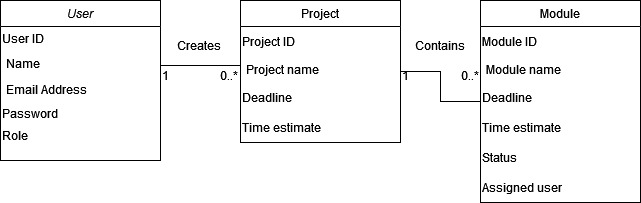
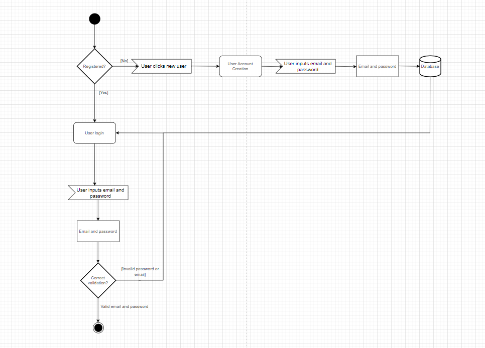
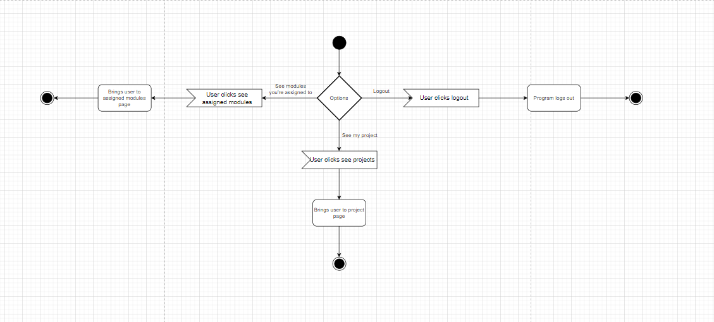
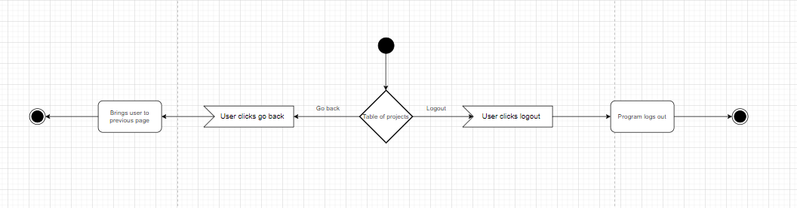

# Alpha Solutions: Eksamensprojekt 2023

## Omkring programmet 
Programmet er et projektkalkulationsværktøj anmodet af Alpha Solutions. Eksamensprojektet går ud på at lave et værktøj som kan håndtere projekter og moduler/opgaver inden i disse. 

## Om programmets struktur
Programmet er struktureret på den måde at brugeren opretter en konto som kan skabe projekter og moduler inden i projekterne. 
Forskellige brugere fra Alpha Solutions kan se hinandens projekter og redigere, slette eller se indholdet i dem. 
Oprettelse, sletning og redigering er begrænset til brugere med "MANAGER" rollen, så brugere uden dette privilegium vil blive markeret som "EMPLOYEE", som blot kan se indholdet af et projekt.
Inden i projekter kan man skabe, redigere eller slette moduler, som er opgaver der er oprettes med en deadline og et tidsestimat. 
Når et modul er oprettet kan man tildele en bruger med "EMPLOYEE" rollen til at udføre opgaven så de er ansvarlige for modulet. 
Der er desuden en tredje brugerrolle som er begrænset til udviklere af programmet: "ADMIN" rollen. Denne rolle har adgang til alt og kan se alle brugere som er gemt på databasen.
Når et modul oprettes med et tidsestimat under et projekt vil projektets eget tidsestimat blive opdateret som summen af alle modulers tid sammenlagt. 
Vores valg af database er MySQL, som bliver håndteret af Java programmet. Hver CRUD operation for brugere, projekter og moduler påvirker databasen. 

Vi har brugt Springboot til at få applikationen til at køre på nettet samt HTML, Thymeleaf og Bootstrap til front-end.  
Der er lavet en dockerfil til at få programmet til at køre på skyen, som findes udenfor "src" mappen. Se linket til Render.com for at se applikationen køre på nettet.

## Domænemodel

## Relationer mellem entiteter

### Strukturen af databasen 

## Klassediagram

### Struktur for alle klasserne i programmet samt deres metoder

## Aktivitetsdiagrammer

## Sekvensdiagrammer

### Processen som opstår når brugeren klikker "Log in"

### Processen for "Sign up"

### Processen for når brugeren udfylder en projektform og klikker "Create project"

